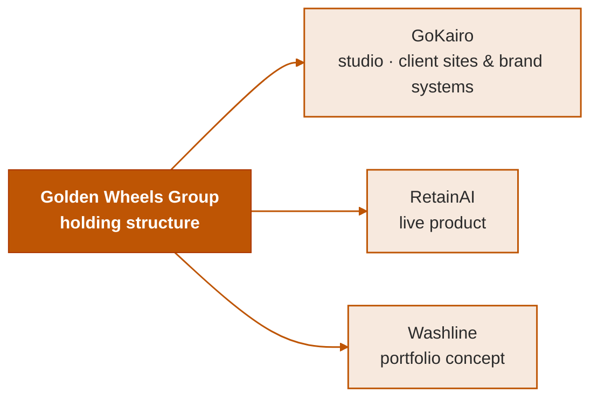

# Prolajide

I build businesses the way most people build one product, and hold every one of them to the same rule: nothing is done until something proves it.

This repository has no build step: it's the profile page GitHub renders here, not a product's source. The ventures below live in their own repos.

**Golden Wheels Group** is the holding structure. **[GoKairo](https://gokairo.framer.website)** is the studio: client sites and brand systems, built rather than templated. **RetainAI** is the first product: [live](https://retainai-nine.vercel.app), a follow-up-message generator small businesses actually keep using because it never sounds like software.

**Stack:** Framer, Next.js 16 (App Router), TypeScript, Tailwind v4, Supabase with row-level security, Claude API. Auth and RLS get phased in deliberately per project rather than scaffolded on day one.

The thread through the ventures is a bias against two failure modes I've watched sink good work: the founder-remembers-it-differently problem, and the green-checkmark-that-proves-nothing problem. A design-token system solved in OKLCH against real contrast constraints, not picked by eye. A register that tracks every "done" claim against a script that has to actually prove it: 250+ live assertions, self-policing, currently green. An item can't be marked closed while the field that's supposed to prove it is empty; that rule caught ten items that weren't actually done the first day it ran.

Over-engineering is the failure I watch for hardest. A rule earns its place by naming the specific thing it prevents, or it doesn't ship.

**Currently:** RetainAI is live and taking real usage. GoKairo is shipping client work. Washline is a portfolio concept: Vancouver expansion of a real Lagos laundromat brand, built to be judged as product work, not a mockup.

**Connect:** Connecting with you will be my pleasure - **[Prolajide](https://www.linkedin.com/in/prolajide/)**
